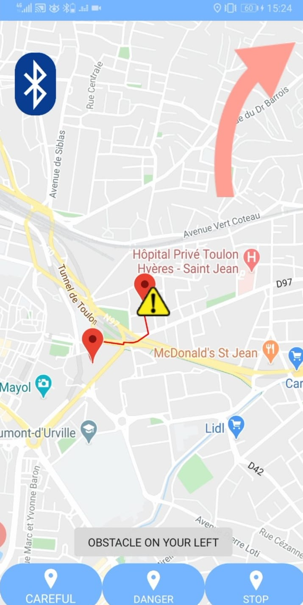
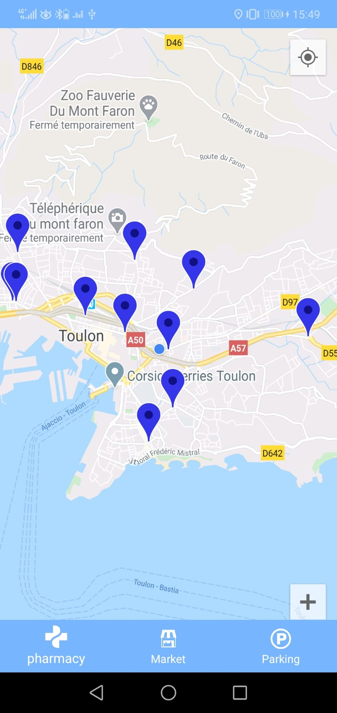

# docus
Projet Master1

Application imitant 'Waze' adaptée à notre prototype. 

 .
 {
  width: 70%;
  border: none;
  background: none;
}
 <!-- .element height="50%" width="50%" -->
{:class="img-responsive"}
{:height="50%" width="50%"}
{:height="700px" width="400px"}

